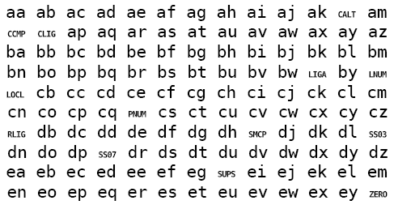

# Nadyezhda SL One

### Test font in OpenType TT (.ttf) format

Digital data copyright (c) 2007 by Adam Twardoch. Based on Bitstream Vera Mono, copyright (c) 2003 by Bitstream, Inc. All Rights Reserved. Licensed under the [Bitstream Vera license](./LICENSE).

This font is a special version of the Bitstream Vera Mono font,
originally designed by Jim Lyles. This version has been reworked
by Adam Twardoch.

The fonts is located in the [ttf](./ttf/) folder.

This font is intended for testing of OpenType Layout features support
in an application. Using a special test string (see below), the user
can selectively turn on and off OpenType features in the application’s
UI and observe which OpenType feature tags are being applied to the
text. Each feature includes one lookup that substitutes two particular
Latin lowercase letters with a special glyph that shows the feature
tag associated with that feature. The result in a test app would look like the following:



The font implements all OpenType feature tags registered in the
OpenType specification version 1.4, as well as two unregistered
tags: `ss21` and `ss22`. All lookups are `GSUB` LookupType 4 (ligature) lookups and are registered in the Latin (`latn`) default languagesystem.

Note that many OpenType Layout features should not be implemented
this way in real-world fonts. For example, the `nukt` (Nukta form)
feature only makes sense when registered in an Indic script, not in
the Latin script. Many of these features should be applied
automatically in certain language/script contexts by the OpenType
Layout engine, and this font is not suitable for testing such
behavior. Also, the recommended implementation for many features
is to include positioning lookups rather than substitution lookups,
and this font also does not fulfil these expectations.

Nonetheless, the font is useful for testing issues such as:
* What feature tags does my application apply by default, without
any user interaction?
* When triggering a particular UI item for applying a certain feature,
is the expected feature being actually applied?
* Does my application have human-readable UI labels for all possible
OpenType features?
* Are the human-readable UI labels for OpenType features localized
into other languages in a sensible way?

“Nadyezhda” is Russian for “Hope”. Along with “Vera” (which was also
the original name for this typeface, and is Russian for “Faith”) and
with “Lyubov” (“Love”), they form the three Biblical virtues,
and rank among the most popular Russian female given names.

The special test string is:

```
aa ab ac ad ae af ag ah ai aj ak al am
an ao ap aq ar as at au av aw ax ay az
ba bb bc bd be bf bg bh bi bj bk bl bm
bn bo bp bq br bs bt bu bv bw bx by bz
ca cb cc cd ce cf cg ch ci cj ck cl cm
cn co cp cq cr cs ct cu cv cw cx cy cz
da db dc dd de df dg dh di dj dk dl dm
dn do dp dq dr ds dt du dv dw dx dy dz
ea eb ec ed ee ef eg eh ei ej ek el em
en eo ep eq er es et eu ev ew ex ey ez
```

You can also consult the [FEA source code](./src/Nadyezhda SL One.fea) for the features defined in the font.
